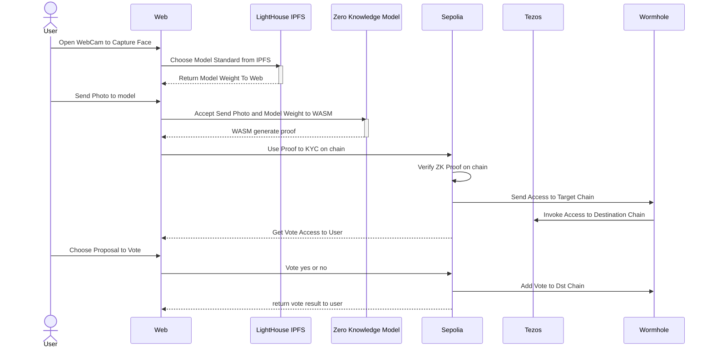

# Turborepo Tailwind CSS starter

This is an official starter Turborepo.

## 

```mermaid
sequenceDiagram
    actor User
    participant Web
    participant I as LightHouse IPFS
    participant Z as Zero Knowledge Model
    participant S as Sepolia
    participant T as Tezos
    participant W as Wormhole
    %% Webcam
    User ->> Web: Open WebCam to Capture Face
    
    Web ->> I: Choose Model Standard from IPFS
    activate I
    I -->> Web: Return Model Weight To Web 
    deactivate I

    %% generate proof
    User ->> Web: Send Photo to model
    Web ->> Z: Accept Send Photo and Model Weight to WASM
    activate Z
    Z -->> Web: WASM generate proof
    deactivate Z

    %% Use Proof to Verify
    Web ->> S: Use Proof to KYC on chain
    S ->> S: Verify ZK Proof on chain
    S ->> W: Send Access to Target Chain
    W ->> T: Invoke Access to Destination Chain 
    S -->> Web: Get Vote Access to User
    %% Vote
    User ->> Web: Choose Proposal to Vote
    Web ->> S: Vote yes or no
    S ->> W: Add Vote to Dst Chain
    S -->> Web: return vote result to user
```