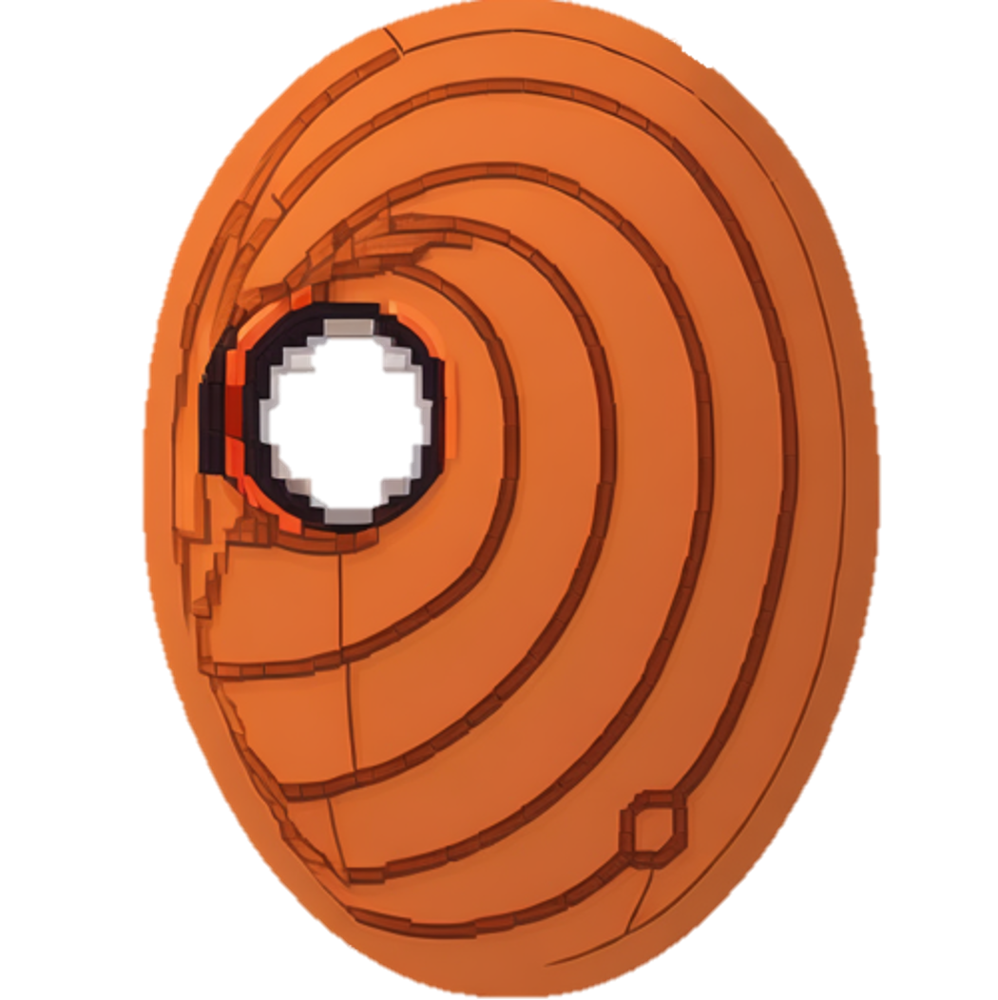

<div align="center">
<h1>Tobi</h1>

<p> An AI-Enhanced KYC Platform (PoC)</p>

</img>

[](./LICENSE) [](https://github.com/hollow-leaf/tobi/deployments) [](https://github.com/hollow-leaf/tobi/actions/workflows/ghpage.yml)
</div>

### Demo Page
- WebPage: [hollow-leaf.github.io/tobi](https://hollow-leaf.github.io/tobi/home)
- Video: [https://youtu.be/](https://youtu.be/)
- Slide: [Google Docs]()
- Tezos Contract: [KT1KqDtnTZMYiEpe81f6u24Jnmq5Hg2h9z5v](https://ghostnet.tzkt.io/KT1KqDtnTZMYiEpe81f6u24Jnmq5Hg2h9z5v/operations/)
- Solidity ZK Verifier(sepolia): [0x950798121c8A4d647Fc156334cCF09c59F038Eb5](https://sepolia.etherscan.io/address/0x950798121c8A4d647Fc156334cCF09c59F038Eb5#code)
- Solidity Vote Contract(Source Chain): [0x585Cd0096cEceB30A8a9698C73Ec19EB4E36e6b1](https://sepolia.etherscan.io/address/0x585Cd0096cEceB30A8a9698C73Ec19EB4E36e6b1#code)
- Solidity Vote Contract(Dstination Chain): [0xd09A679e9FDdffaD016a4fB24597499B0154B189](https://goerli.etherscan.io/address/0xd09A679e9FDdffaD016a4fB24597499B0154B189#code)
- ZK Original Model(Write By Python): [Tobi Model](https://github.com/hollow-leaf/tobi-models)

### Abstract
The surge in popularity of major language models underscores the significance of nuanced language adjustments. Thus, we've established a public marketplace for fine-tuning models, enabling verification and payment on-chain. 
Simultaneously, we employ zero-knowledge proofs to safeguard user data while achieving this. Deploying large models on-chain is challenging, so we employ IPFS for model weight storage and WASM for proof generation. The validation of proof on-chain is executed via Zero Knowledge methods. We've incorporated Wormhole for seamless cross-chain data transfer and opted for Tezos to house vote results.

### Problem Statement
- Large Model Deployment: Successfully mitigated the difficulty of deploying large models on-chain.
- Model Verification: Developed a solution to ensure accurate model verification.
- Cross-Chain Data Transfer: Resolved the issue of transferring data seamlessly between different chains.
- Vote Result Storage: Implemented a method to securely store and manage vote results.

### Solution
- Use IPFS to store model weight
- Use WASM to generate proof
- Use Zero Knowledge to verify the proof on chain
- Use Wormhole to transfer data between chains
- Use Tezos to store vote result

### Technical Architechure


### Build & Installation

> Tobi is a monorepo managed using turbo. You can find the source code for each package in the `apps` and `packages` directory.

- `apps/web` is the web frontend for Tobi. It is built using [Next.js](https://nextjs.org/).
- `packages/zk-circuits` is the zero knowledge circuits and evm contracts for Tobi.
- `packages/tezos-contract` is the tezos contract for Tobi.
- `packages/tezos-interact` is the tezos interact SDK Tobi.
- `packages/helper` contain lighthouse ipfs helper.

1. Install all peer dependencies

```sh
pnpm install
```

2. Deploy the zk circuits verify contract
```sh
cd packages/zk-circuits
cp .env.example .env
# fill in the .env file
```

after fill in private key and infura key, run the following command
```sh
pnpm run deploy:zk
```

3. Deploy the wormhole crosschain voting contract
```sh
# same directory as step 2
# cd packages/zk-circuits
pnpm run deploy:wormsrc
pnpm run deploy:wormdst
```

4. Deploy the tezos contract (use ligo online ide to deploy is better in this step)

[ligolang ide](https://ide.ligolang.org/)

5. Start the Frontend
```sh
# cd ../../apps/web
cd apps/web
cp .env.example .env
# fill in the .env file
pnpm run dev
```

6. (Optional) Deploy and Copy Static Files to gh-pages or S3

```sh
pnpm build
```

7. Arweave Upload Model Service
```sh
# copy private key to packages
touch packages/arweave-service/wallet.json
docker-compose -f packages/arweave-service/docker-compose.yaml up -d --build ar_backend 
```
### Contributors
- Frontend + Voting Contract: [YeeeTai](https://github.com/YeeeTai)
- ZKML Model Circuits + Wormhole Support + LightHouse Support: [kidneyweakx](https://github.com/kidneyweakx)
- Tezos Contract: [Pianochicken](https://github.com/Pianochicken)